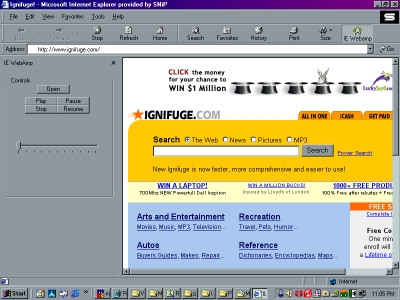



## \[UPDATED\] IE Webamp \(How to make Explorer band addons for IE\)

### Description

This is an explorer band addon for IE/Windows Explorer (ie when you click on Favorites the little side bar that comes up is an Explorer Band)

the example is a simple mp3 player that runs while IE is open so you can listen to mp3s while you look at webpages...you could change this into something more useful...vote vote vote!!! Read the README file first!!!!!! New Update!! added a readme and .reg file with instructions for adding a button to the IE toolbar for IE Webamp!!! Vote!!

[new screenshot!]

xTrin
 
### More Info
 
you need the vbshell type library which is included as well as windows media player, common dialog controls, and ms common controls, also some knowledge of the Registry would help

             |
---                |---
**Submitted On**   |2000-12-07 22:57:34
**By**             |[xTrin](https://github.com/Planet-Source-Code/PSCIndex/blob/master/ByAuthor/xtrin.md)
**Level**          |Intermediate
**User Rating**    |4.7 (231 globes from 49 users)
**Compatibility**  |VB 6\.0
**Category**       |[Miscellaneous](https://github.com/Planet-Source-Code/PSCIndex/blob/master/ByCategory/miscellaneous__1-1.md)
**World**          |[Visual Basic](https://github.com/Planet-Source-Code/PSCIndex/blob/master/ByWorld/visual-basic.md)
**Archive File**   |[CODE\_UPLOAD124551272000\.zip](https://github.com/Planet-Source-Code/xtrin-updated-ie-webamp-how-to-make-explorer-band-addons-for-ie__1-13385/archive/master.zip)

### API Declarations

in the code

